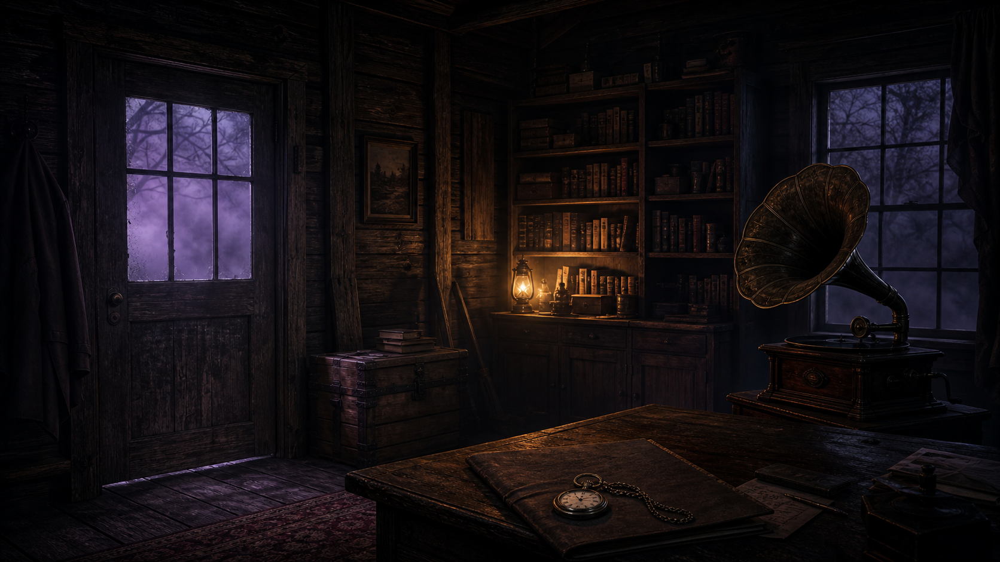

# FOGBOUND V

### An interactive narrative experience about curiosity, repetition, and a forest that remembers you.

**Narrative Design · Writing · Game Design · Development**

[Play Fogbound V](https://fogboundstories.com)



Fogbound V is a browser-based interactive narrative experience built around a simple idea:

> What if moving through a story was itself part of the story?

Instead of presenting its world through traditional exposition, Fogbound asks the player to explore it. The forest loops. Objects appear where there was previously nothing. Whispers react to progression. Stories are discovered as physical artifacts. Continuing forward gradually changes what the player is allowed to see.

The player's curiosity becomes the primary progression mechanic.

## The Design Problem

Fogbound began as a fictional world developed through short stories. When translating that world into an interactive experience, I did not want to place those stories on a conventional website and connect them with buttons.

I wanted the interface itself to behave like Fogbound.

That created the central design question:

> How can an environment make the player feel that it remembers them without directly telling them that it does?

The answer became repetition.

The player moves deeper into the forest only to discover that they have returned to somewhere familiar—but the forest is not quite the same. Each traversal can advance narrative state, reveal a previously hidden artifact, trigger an environmental change, or expose new information.

Repetition therefore functions as both a gameplay system and a storytelling device.

## Narrative Systems

### The Loop

Movement through the forest eventually returns the player to familiar territory. The loop establishes one of the experience's central rules:

> Moving forward does not necessarily mean escaping.

Repeated traversal provides a structure for narrative progression without conventional levels or chapter selection.

### Persistent Narrative State

Fogbound tracks player progression so the environment can respond to what has already happened. State persists across the experience and coordinates discoveries, loop progression, environmental behavior, and available interactions.

Narrative events are not simply displayed in a fixed sequence. Progression determines when elements surface and how the environment behaves.

### Artifact Discovery

Story material exists inside the experience as discoverable artifacts: fragments, recovered entries, field notes, and recordings connected to the larger Fogbound world.

Artifacts are withheld until progression conditions are met. Lore becomes something the player finds rather than information the interface automatically gives them.

### Environmental Storytelling

Fog, sound, imagery, object placement, repetition, and changes in the environment communicate information alongside written narrative.

The goal is to create uncertainty about whether the player is simply navigating the forest—or whether the forest is responding to them.

### Conditional Events

Whispers, discoveries, encounters, and visual changes occur after specific narrative conditions have been reached. These events act as consequences of continued exploration and make progression legible through the environment rather than a traditional quest log.

### Memory and Return

The experience remembers player progress between visits. Returning does not always mean starting from an untouched state; the archive and forest can retain evidence of what the player has already encountered.

## Example Player Experience

```text
Enter the forest
        ↓
Explore deeper
        ↓
Notice environmental details
        ↓
Return somewhere unexpectedly familiar
        ↓
Discover something that was not there before
        ↓
Continue and loop again
        ↓
The forest responds differently
        ↓
Realize repetition is part of the experience
```

The objective is not communicated through a conventional quest marker. Curiosity is what moves the player forward.

## Writing for Interaction

Fogbound V exists beyond this application as a larger collection of original fiction, characters, and interconnected stories. Translating that material into an interactive format created a different writing problem from traditional prose.

In fiction, the writer controls when the reader receives information. In Fogbound, I had to consider:

- What does the player currently know?
- What have they discovered or ignored?
- When should an artifact become available?
- How long should uncertainty remain?
- Which information belongs in prose?
- Which information should come from the environment?
- What should never be explicitly explained?

The result is a narrative designed around discovery rather than exposition.

## The Recovered Journal

The cabin acts as a persistent archive for stories and recordings recovered during the experience. Its illustrated journal reframes reading as an in-world interaction rather than a separate content menu.

The journal currently connects the player's discoveries to:

- **Entry 0 — Ben's Story**
- **Entry 1 — Nested Dolls**
- **Entry 2 — 18:21**
- **What Lies in the Fog** — a recovered audio story with preview, chapter selection, and persistent access

The gramophone extends that archive into sound. Recovered recordings become playable within the environment, while progression and ownership determine which controls are available.

## Design Philosophy

Fogbound follows three primary principles.

### Trust curiosity

The player should not need constant instructions telling them where to go. Attention and uncertainty are part of the intended experience.

### Let mechanics carry narrative meaning

The loop is not separate from the story. The loop is part of the story. Persistence, repetition, discovery, and withheld information all communicate something about the world.

### Withhold deliberately

Not understanding something immediately can be more valuable than receiving an immediate explanation. The experience is built around the tension between wanting answers and questioning whether continuing to search for them is a good idea.

## My Role

**Creator · Narrative Designer · Writer · Developer**

I designed and implemented:

- Original worldbuilding and written narrative
- Interactive narrative structure
- Exploration and loop progression
- Persistent narrative state
- Conditional events and encounters
- Artifact discovery and gating
- Environmental storytelling
- Interface and interaction design
- Audio and visual integration
- Recovered journal and gramophone systems
- Player-journey and audio-engagement analytics
- Front-end application architecture

## Implementation

Fogbound is structured as a React application rather than a static story page. Application state coordinates progression and environmental behavior across the experience.

**Core technology**

- React 18
- JavaScript
- Zustand
- Vite
- HTML/CSS
- Vercel serverless functions

The repository is organized into components, hooks, visual layers, systems, state, configuration, and utilities. Supporting APIs handle archive access, purchases, recovery links, email delivery, and anonymous journey metrics.

## What I Was Exploring

Fogbound became an experiment at the boundary between fiction, game design, and browser interaction:

- Can scrolling become movement?
- Can repetition become a mechanic?
- Can discovering a document feel like finding an object?
- Can a browser remember what the player has done?
- Can an interface participate in the fiction?

Those questions became as important to the project as the underlying story.

## Run Locally

```bash
npm install
npm run dev
```

Payment, email, archive-recovery, and persistent metrics features require their corresponding server environment variables. The interactive narrative can still be explored locally without those external services.

## Project Status

**Active / In Development**

Fogbound V continues to evolve as both an original fictional universe and an interactive narrative project. Current development is focused on clarity, player-choice consequences, narrative-state legibility, and measuring how players move from discovery into deeper story engagement.
